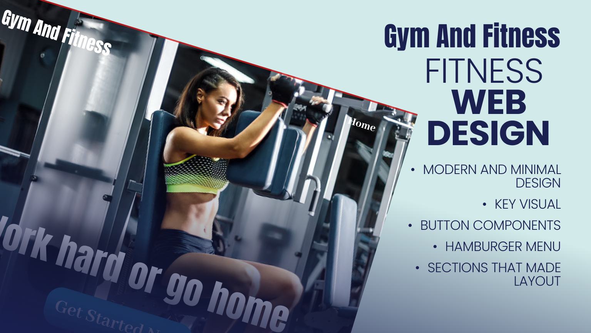
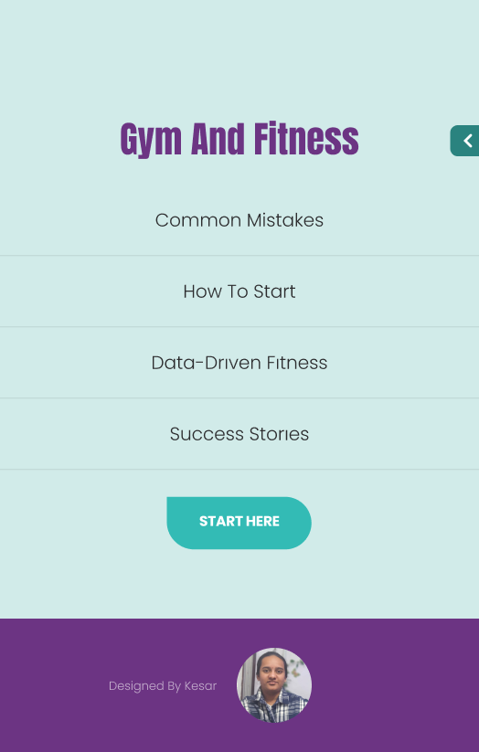
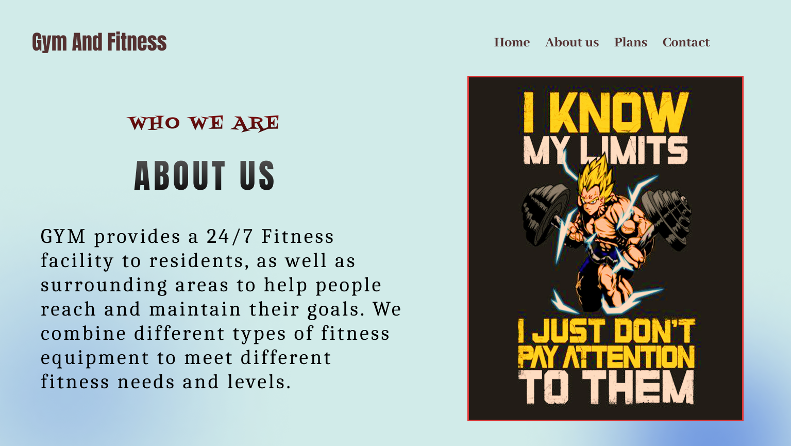
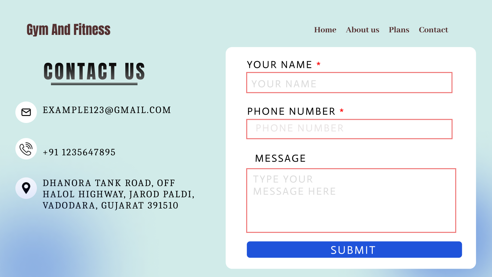
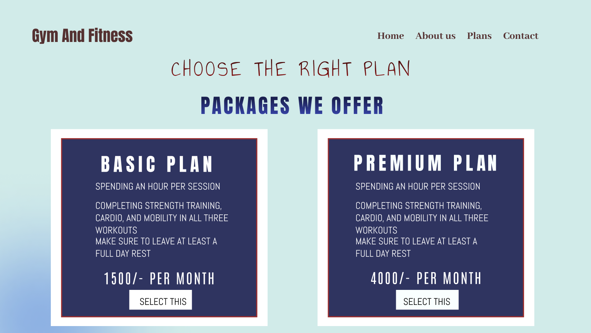

# Gym & Fitness Website – Figma Project

## Project Overview

This is a modern and responsive **Gym & Fitness Website** designed in Figma. The design emphasizes a bold, motivating aesthetic tailored for fitness professionals, gyms, or personal trainers. It includes:

- Hero landing page
- About section
- Pricing and subscription plans
- Contact form
- Navigation (hamburger menu)

> Designed to balance aesthetics with usability, the layout is ideal for product startups, service businesses, or personal portfolios.

---

## Screenshots

| Desktop View | Mobile View | Other Sections |
|--------------|-------------|----------------|
|  |  |        |

---

## Figma Project Link

[View the Gym & Fitness Website on Figma](https://www.figma.com/proto/z8KHWOssWHiPfxxjg0yt9k/Gym---Fitness-Website?node-id=2222-19&t=DdRbgtLrFrj8Mb1s-0&scaling=min-zoom&content-scaling=fixed&page-id=0%3A1&starting-point-node-id=2222%3A19)
 
---

## Tools Used

- Figma
- Font: Caladea, Anton, Poppins, Fontdiner Swanky, Abel, Annie Use Your Telescope

---

## Key Features

- Clean, modern UI with clear typography
- Structured with usability in mind

---

## Project Structure

Figma-Website-Design/
├── README.md
├── images/
│ ├── cover.png
│ ├── Website.png
│ ├── about.png
│ ├── Contact.png
│ ├── Plan.png
│ └── hamburger.png
├── figma-link.txt
